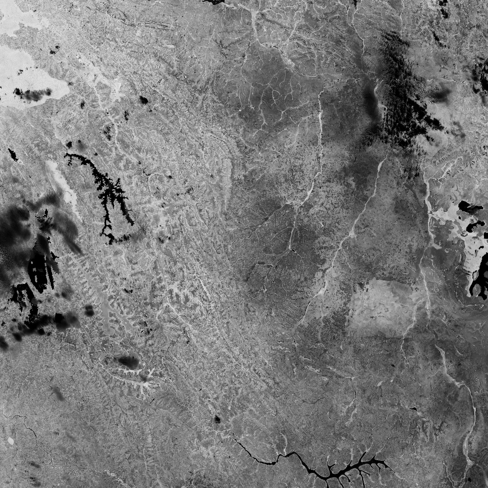

# sentinel2-to-ndvi

Convert Sentinel 2 spectral data to NDVI.

The [NDVI](https://en.wikipedia.org/wiki/Normalized_difference_vegetation_index) is a widely used index to messure vegetation.

We use high resolution satellite data from the Sentinel 2 satellites to calculate the NVDI on a 10m square.

## Example


Area around Nyagatare, Rwanda.

White is a value of 1.0, which is best, Black means bad or no vegetation.


## Prerequisites

- Create an account on https://scihub.copernicus.eu to download satellite data.
- Install Python 3
- Use pip3 installer to install the following packages:
```
pip3 install rasterio
pip3 install numpy
pip3 install boto3
```

## Download spectral data
- Go to https://scihub.copernicus.eu/dhus/
- Sign up and Log in (free)
- Select an area using right mouse click
- Open Filter Panel
  - Check `Mission: Sentinel-2`
  - Cloud coverage: `[0 TO 10]`
- Download
- Extract ZIP
- Look for image data for the band 4 and band 8, i. e. look for files ending `_B04_10m.jp2` and `_B08_10m.jp2` or `_B04.jp2` and `_B08.jp2` in the `GRANULE` folder.
- Use these files in the convert_to_ndvi.py, as described in the How-To

## How-To

```
python3 convert_to_ndvi.py -b4 https://sentinel2-to-ndvi.s3.eu-central-1.amazonaws.com/examples/T35MRU_20190915T080611_B04_10m.jp2 -b8 https://sentinel2-to-ndvi.s3.eu-central-1.amazonaws.com/examples/T35MRU_20190915T080611_B08_10m.jp2 -out ndvi.tif 
```

The b4 and b8 files can be read locally or as http resources.

Creates a 500 MB TIF file. Download [Example](https://sentinel2-to-ndvi.s3.eu-central-1.amazonaws.com/examples/T35MRU_20190915T080611_ndvi.tif).


## More Information

Project in cooperation with [GaiaGreenhouses](https://www.facebook.com/GaiaGreenhouses/).


